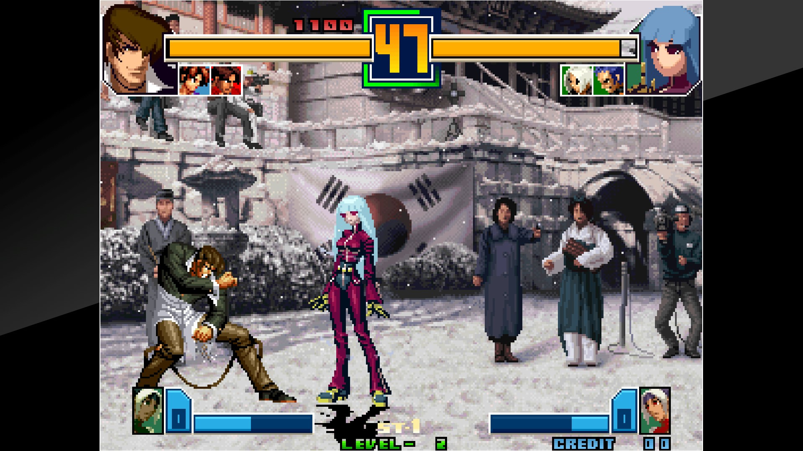
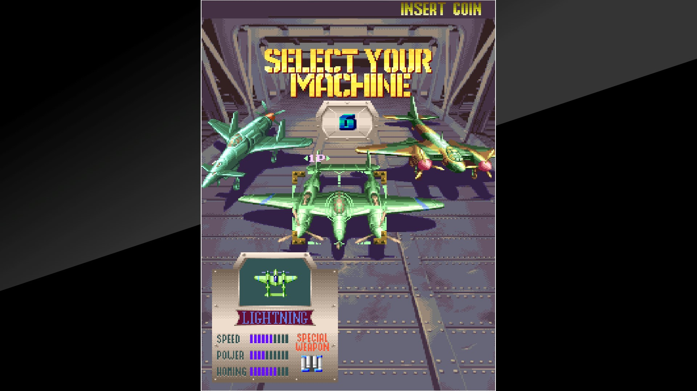

# Retroarch Arcade Archives Bezel

This is a bezel made based on [HAMSTER's Arcade Archives](http://hamster.co.jp/american_hamster/arcadearchives/) series using [Gimp](https://www.gimp.org/).

This project include horizontal and vertical bezels for the following resolutions:

- 1920x1080px

## How to use the bezels

 1. Clone or download the project in your PC.
 2. Load Retroarch.
 3. After launching the game, press F1 and go to Quick Menu > On-Screen Display > Overlay Preset and select one of the *.cfg files.
 4. Save the configuration by going to Overrides > Save Core Overrides

## Preview

The King of Fighters 2001 (NGM-262?)

19XX - the war against destiny (951218 Brazil)

